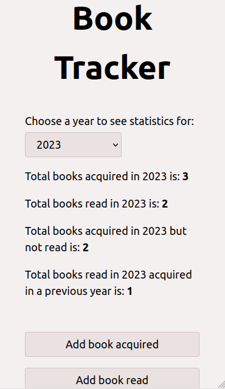
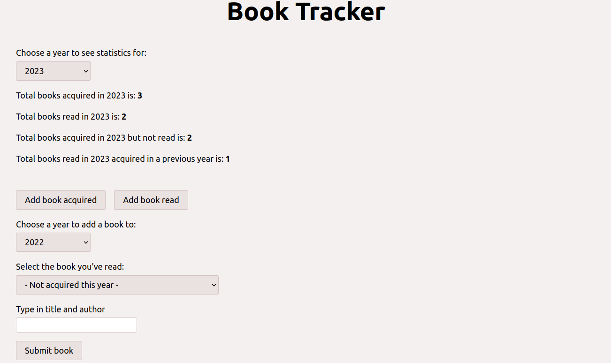

# Book Tracker

Tracking books acquired and read.

## Table of contents

- [General info](#general-info)
- [Screenshots](#screenshots)
- [Technologies](#technologies)
- [Setup](#setup)
- [Status](#status)

## General info

Each year I have a goal for the number of books acquired vs read, to try and whittle down my to read list. And try and prevent me from buying too many books (Kobo selling books for 99p has a lot of answer for). Although the json files in here were created from my original spreadsheet, I cut the list down a lot because it was hard to check if the numbers were the same.

## Screenshots




## Technologies

- React
- SCSS
- Express
- Vite
- Vitest
- Cypress

## Setup

To view this project visit the [demo](https://book-tracker-nm.onrender.com) or download the files, open a terminal in that folder and install locally using npm:

```
npm install
```

Run the app locally:

```
npm run dev
```

## Status

Project is: _finished_
